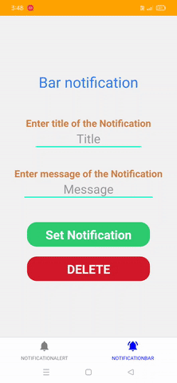

# Any Notification

Any Notification react-native app.
This app was mainly built for my personal use and to learn more about react native.
This app can give Scheduled Notification and Alert Notification.
Alert Notification will always be on the status bar of the mobile,
which will help in remember of the Notification until it is cleared. 
Alert Notification will only disappear when user clicks on the delete button from the app.

## Built with

* React-Native

  
## Lessons Learned

I learnt more about react-native.
I was able to quickly setup the dev Environment for building the app.
I learnt about the react-native-PushNotification.
I learnt about `AsyncStorage` usage in react native app.

## Demo

  
## Features

- Scheduled Notification.
- Deleting Scheduled Notification.
- Alerting Notification.

  